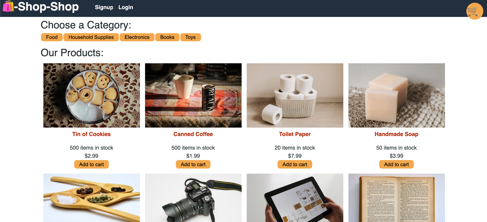

# shop-shop

## License

#### License Link 🎫

- [License: MIT](LICENSE)

#### Badge 🏆

## Description 📖

- The "Shop-Shop" application is a e-commerce platform that uses [Redux](https://redux.js.org/) to manage global state. It allows the user to Log-In/Sign-Up to their own account, once created they are able to purchase items on the website using a payment method known as [Stripe](https://stripe.com/).

## Table of Contents

- [Built-With 🎮](#built-with)
- [Screenshot 🎬](#screenshot)
- [Link 🧑🏻‍💻](#link)
- [Contribution 👾](#contribution)
- [Contact 📟](#contact-me/questions)

## Built With

- HTML
- CSS
- JavaScript
- MongoDB
- Mongoose
- ExpressJS
- GraphQL
- ReactJS

## Screenshot

## Link

- [Deployed Link](https://calm-savannah-71674.herokuapp.com/)

## Contribution

This project was successfully built by myself “Kevin Hernandez” and the use of some Google searches and StackOverflow late night questions.

## Contact Me/Questions

- GitHub: [Kevin-Hernandez-Garza](https://github.com/Kevin-Hernandez-Garza)

- Email: [kev.hernandezgarza@gmail.com](mailto:kev.hernandezgarza@gmail.com)

### © Created with 💜 by Kevin Hernandez!
